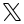

	
	
	
	
	
	

Меня зовут Борис Орехов. Я занимаюсь [научными исследованиями](https://www.semanticscholar.org/author/Boris-Orekhov/2080424505) и иногда говорю про них [в популярном жанре](https://postnauka.org/themes/orehovb). Еще я пишу код, как полезный, так и развлекательный.

Я опубликовал [десятки моделей на HuggingFace](https://huggingface.co/nevmenandr), мой основной язык Python, но иногда я совершаю набеги и в другие языки, в том числе [эзотерические](https://sysblok.ru/blog/jezoterika-programmirovanija/). Про фантастику и NLP можно почитать [мои тексты на Хабре](https://habr.com/ru/users/nevmenandr/publications/articles/). А еще можно послушать мои подкасты 
 [про литературу](https://nevmenandr.github.io/nonbrevia/) и про [университеты](https://universitates.ru/). Кроме того, я нарисовал несколько 
 [шрифтов](https://nevmenandr.github.io/18cent-font/).

                                       

<code></code>
<code></code>
<code></code>
<code></code>

    
